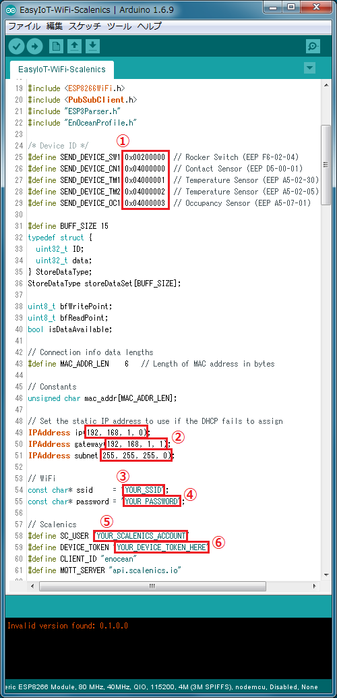

Easy IoT Development Kit (Wi-Fi)
====

「Easy IoT Development Kit (Wi-Fi)」は、[EnOcean Library for Arduino](https://github.com/simics-co/EnOcean)を使って、
お手軽IoTシリーズのセンサー情報をIoTクラウド：[Scalenics](http://scalenics.io/)へグラフ表示することができます。

## Description
本スケッチは、以下のEEP(EnOcean Equipment Profiles)に対応しています。

* F6-02-04
* D5-00-01
* A5-02-05
* A5-02-30
* A5-07-01

## Demo

EnOcean Shield (TCM410J)で受信した無線データ(センサー情報)を、[Scalenics](http://scalenics.io/)へグラフ表示します

 

## Requirement

* お手軽IoT開発キット(ESPr One + DolphinV4(GWC) Shield)を用意してください
* [Arduino LLC (Arduino.cc)](https://www.arduino.cc/) Arduino IDE 1.6.4以降のバージョンを使用してください 
  ※[Arduino SRL (Arduino.org)](http://www.arduino.org/)系のArduino IDE 1.7.Xでは、ESP8266ボードを追加できません

## Usage

1. 「EasyIoT-wifi-scalenics.ino」を実行します
2. スケッチ内の以下の項目を変更します 
　
   * ① お手持ちのセンサーのIDに書き換えます
   * ② 接続するルーターのIPアドレスが固定の場合は、そのIPアドレス, デフォルトゲートウェイ, サブネットマスクに書き換えます（通常、変更する必要はありません）
   * ③ 接続する無線ルーターのSSIDに書き換えます
   * ④ 接続する無線ルーターの暗号化キー（パスワード）に書き換えます
   * ⑤ ScalenicsのUsername(ID)に書き換えます
   * ⑥ ScalenicsのManagement Console -> Admin Profile内にある「Device Token」に書き換えます

※スケッチをマイコンボードに書き込むときは、EnOcean ShieldのSW3を「Prog」側にしてください。通常はSW3を「Normal」側にしてください。

## Install

1. [このサイト](http://trac.switch-science.com/wiki/esp_dev_arduino_ide)を参考に、Arduino IDEへESP8266ボード version 2.3.0以降を追加します 
   ※Arduino IDE 1.6.9, ESP8266ボード version 2.3.0の設定例は、以下の通りです 
   
2. [EnOcean Library for Arduino](https://github.com/simics-co/EnOcean)をインストールします
3. [Arduino Client for MQTT](https://github.com/knolleary/pubsubclient)をインストールします 
   ※インストール手順は、「[EnOcean Library for Arduino](https://github.com/simics-co/EnOcean)」のREADME.md：Install 1～4を参考にしてください
4. [GitHub repository](https://github.com/simics-co/EasyIoT-wifi-scalenics)から[EasyIoT-wifi-scalenics-master.zip](https://github.com/simics-co/EasyIoT-wifi-scalenics/archive/master.zip)をダウンロードします
5. 圧縮ファイルを展開し、フォルダ名を「EasyIoT-wifi-scalenics」へ変更します

## Contribution

1. Forkする ( https://github.com/simics-co/EnOcean#fork-destination-box )
2. ローカル上でbranchを作る (git checkout -b my-new-feature)
3. 変更した内容をcommitする (git commit -am 'Add some feature')
4. pushする (git push origin my-new-feature)
5. Pull Requestを作成する

## Licence

   Copyright 2016 LoonaiFactory

   Licensed under the Apache License, Version 2.0 (the "License");
   you may not use this file except in compliance with the License.
   You may obtain a copy of the License at

       http://www.apache.org/licenses/LICENSE-2.0

   Unless required by applicable law or agreed to in writing, software
   distributed under the License is distributed on an "AS IS" BASIS,
   WITHOUT WARRANTIES OR CONDITIONS OF ANY KIND, either express or implied.
   See the License for the specific language governing permissions and
   limitations under the License.

## Author

[LoonaiFactory](https://github.com/loonaifactory)
